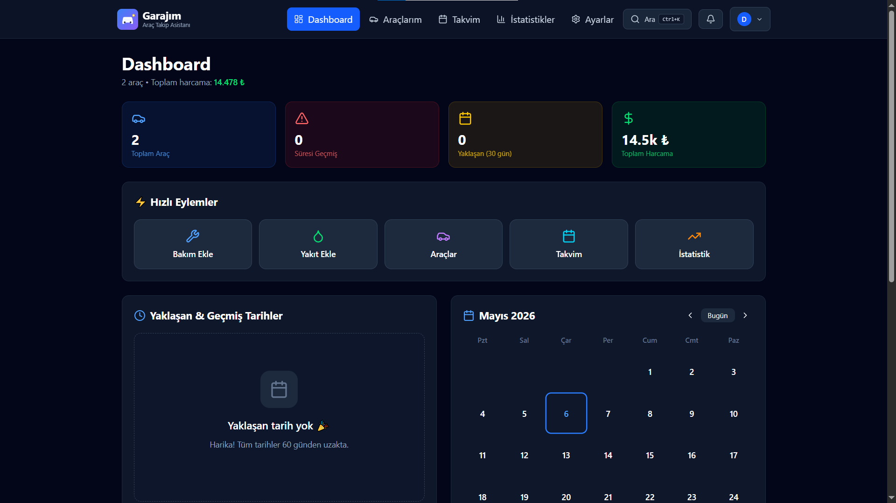
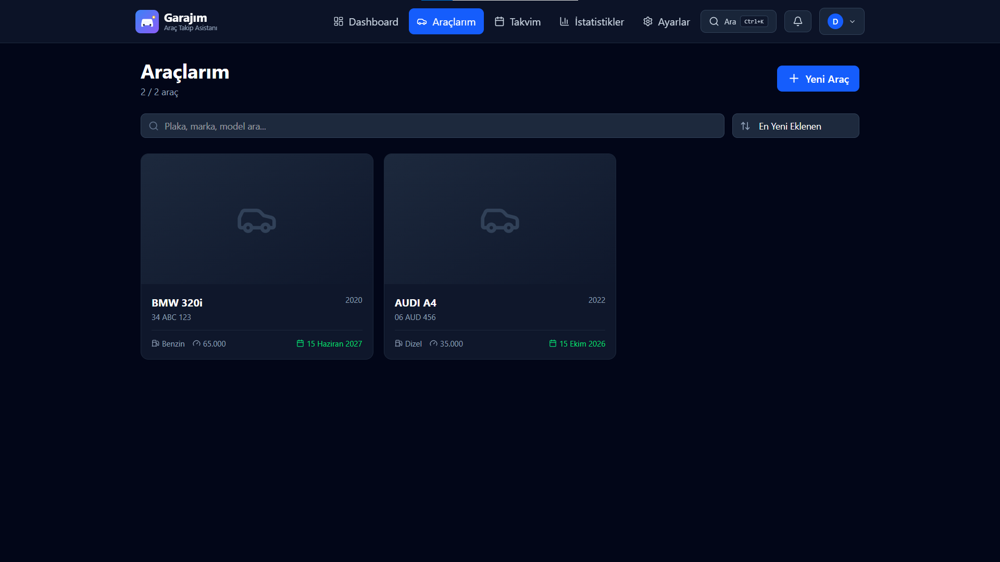
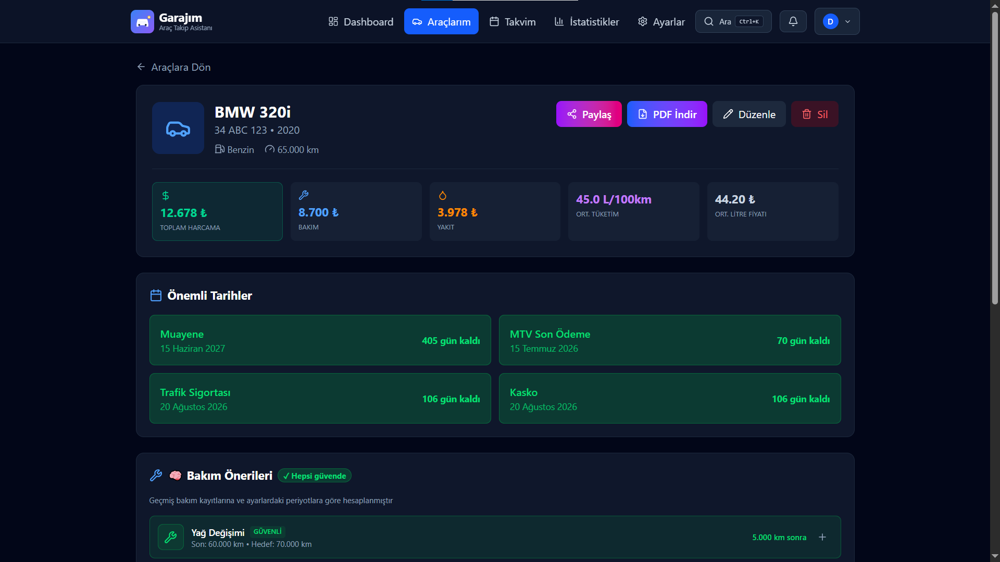
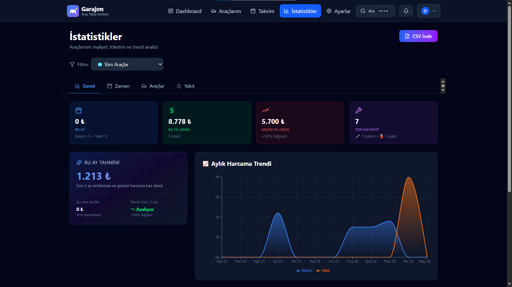
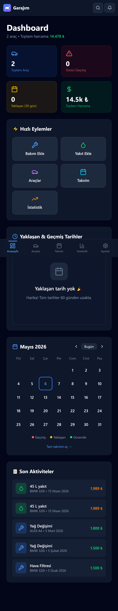
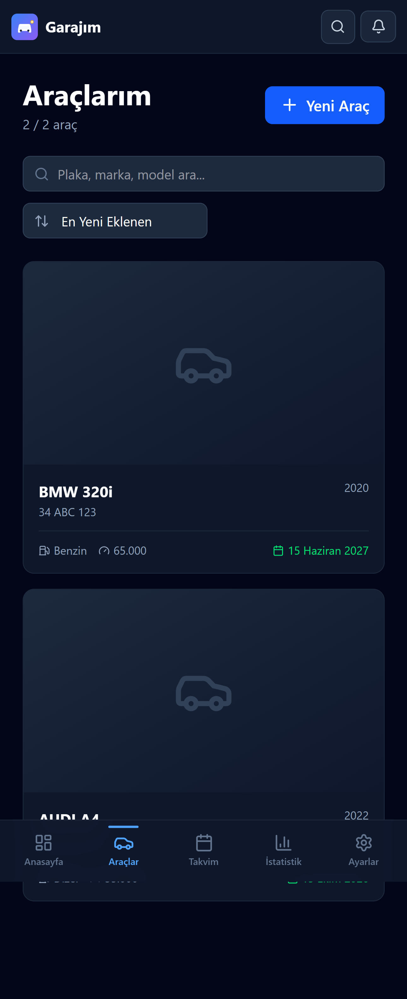
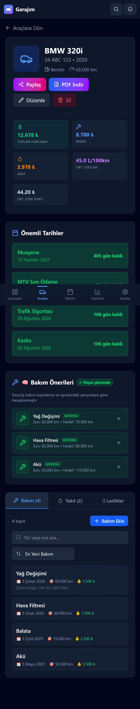
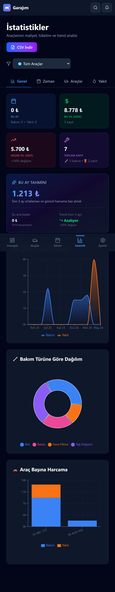

<div align="center">

# 🚗 Garajım

### Araç Bakım & MTV Takip Asistanı

**Aracını takip etmenin en kolay yolu — Bakım, MTV, sigorta, lastik ve yakıt takibi tek uygulamada.**

[](https://garajim-sage.vercel.app)
[](https://github.com/YusufKosarDev/garajim)

[](https://react.dev)
[](https://vitejs.dev)
[](https://supabase.com)
[](https://tailwindcss.com)
[](https://web.dev/progressive-web-apps/)
[](https://cypress.io)
[](LICENSE)

</div>

---

## 📸 Önizleme

<div align="center">

### 💻 Desktop



<details>
<summary>📂 Daha fazla ekran görüntüsü</summary>

<br />

**Araçlarım Sayfası**


**Bakım Takibi**


**İstatistikler**


</details>

### 📱 Mobile

<table>
  <tr>
    <td align="center">
      <br />
      <sub><b>Dashboard</b></sub>
    </td>
    <td align="center">
      <br />
      <sub><b>Araçlarım</b></sub>
    </td>
    <td align="center">
      <br />
      <sub><b>Bakım Takibi</b></sub>
    </td>
    <td align="center">
      <br />
      <sub><b>İstatistikler</b></sub>
    </td>
  </tr>
</table>

</div>

---

## 🌟 Hakkında

**Garajım**, Türkiye'deki araç sahiplerinin tüm araç işlerini takip edebileceği modern bir Progressive Web App (PWA). Bakım kayıtları, MTV ödemeleri, sigorta yenilemeleri, lastik durumu ve yakıt tüketimi — hepsi tek bir uygulamada.

🎯 **Kimin İçin?** Aracını profesyonelce takip etmek isteyen herkes için. **Aileler, küçük filolar, oto galeriler** için çoklu kullanıcı desteği de var.

🔥 **Ne Yapar?** Yaklaşan bakımları hatırlatır, yıllık masrafını gösterir, yakıt tüketimini hesaplar, lastik diş derinliğini takip eder, **yakındaki servisleri haritada bulur**.

⚡ **Production-grade fullstack:** Supabase tabanlı (PostgreSQL + RLS + Storage + Edge Functions), real-time multi-device & multi-user senkron, otomatik email hatırlatmaları (cron + Resend), Google OAuth, PWA, **multi-tenancy workspace pattern**, **Cypress E2E test coverage**.

---

## ✨ Özellikler

### 🔐 Authentication & Hesap
- ✅ **Email + Şifre** — Email doğrulama zorunlu (production-ready)
- ✅ **Google OAuth** — Tek tıkla giriş ("Sign in with Google")
- ✅ **Şifre sıfırlama** — Email ile güvenli reset
- ✅ **Profil yönetimi** — Şifre/email değiştir (re-authentication ile)
- ✅ **Hesap silme (KVKK)** — Tüm verilerle birlikte kalıcı silme

### 🏢 🆕 Çoklu Kullanıcı / Workspace
- ✅ **Garaj paylaşımı** — Aile üyeleri, partneri, kardeşinle aynı garajı yönet
- ✅ **Email ile davet** — Token-based güvenli davet sistemi
- ✅ **Üye yönetimi** — Owner üye ekleyebilir/çıkarabilir
- ✅ **Roller** — Owner ve Member rolleri
- ✅ **Multi-tenancy mimari** — `garages` + `garage_members` + `garage_invitations` tabloları
- ✅ **Granular RLS** — Workspace pattern ile veri izolasyonu (`user_garage_ids()` helper)

### 🚙 Araç Yönetimi
- ✅ **Çoklu araç desteği** — Sahip olduğun tüm araçları tek yerde
- ✅ **Detaylı bilgi** — Plaka, marka, model, yıl, yakıt tipi, KM
- ✅ **Çoklu fotoğraf** — Cloud storage'a otomatik yükleme (CDN)
- ✅ **Otomatik plaka formatı** — TR plaka formatı doğrulaması

### 📅 Tarih Takibi
- ✅ **Muayene** — Yaklaşan muayene tarihlerini hatırla
- ✅ **MTV** — Motorlu Taşıt Vergisi takibi (Ocak/Temmuz)
- ✅ **Sigorta + Kasko** — Yenileme tarihleri
- ✅ **Akıllı bildirimler** — 30 gün, 7 gün ve 1 gün kala uyarı

### 📧 Email Bildirimleri (Otomatik)
- ✅ **Cron job** — Her gün 09:00'da otomatik kontrol (pg_cron)
- ✅ **Yaklaşan tarih hatırlatması** — Muayene, MTV, sigorta, kasko
- ✅ **Branded HTML email** — Aciliyet renkleri (1 gün → kırmızı, 7 gün → turuncu, 30 gün → mavi)
- ✅ **Kullanıcı tercihleri** — Master switch + 4 spesifik toggle (DB'de saklı)
- ✅ **Resend entegrasyonu** — Modern email API

### 🔄 Real-time Multi-cihaz & Multi-kullanıcı Senkron
- ✅ **WebSocket subscription** — postgres_changes ile canlı dinleyici
- ✅ **Anlık güncelleme** — Telefondan ekleyince bilgisayarda F5'siz görünür
- ✅ **Çoklu kullanıcı sync** — Garajı paylaştığın kişinin değişiklikleri anında ekrana yansır
- ✅ **Echo prevention** — Optimistic UI + duplicate engellemesi
- ✅ **Tüm tablolar** — Araç, bakım, yakıt, lastik, lastik değişim, custom periyot

### 🔧 Bakım Modülü
- ✅ **15+ bakım türü** — Yağ, filtre, balata, vs.
- ✅ **Özel periyot ayarı** — Her araç için ayrı periyot
- ✅ **KM ve tarih bazlı uyarı** — Hangisi önce gelirse
- ✅ **Maliyet takibi** — Toplam harcama analizi
- ✅ **Fatura fotoğrafı** — Cloud storage'a otomatik yükleme

### ⛽ Yakıt Takibi
- ✅ **Detaylı kayıt** — Litre, fiyat, toplam, istasyon
- ✅ **Otomatik hesaplama** — Fiyat × litre = toplam
- ✅ **Tüketim analizi** — L/100km hesabı (full-tank metoduyla)
- ✅ **🆕 Akıllı İçgörü** — "Hep en ucuz istasyondan alsaydın X TL tasarruf ederdin"
- ✅ **İstasyon karşılaştırması** — En ucuz/pahalı vurgu, ortalama TL/L

### 🛞 Lastik Modülü
- ✅ **Yazlık + Kışlık set** — Mevsimlik takip
- ✅ **DOT kod analizi** — Lastik yaşı tespiti
- ✅ **Diş derinliği** — Risk seviyesi (4 kademe)
- ✅ **Mevsim değişim geçmişi** — Tüm değişimler kayıtlı
- ✅ **Türkiye kış lastiği takvimi** — Yasal zorunluluk hatırlatması

### 📊 İstatistikler & Raporlar
- ✅ **Yıllık masraf grafikleri** — Aylık trend analizi
- ✅ **🆕 Yıl sonu maliyet tahmini** — Linear extrapolation ile öngörü
- ✅ **🆕 Year-over-year karşılaştırma** — Geçen yılla bu yılı kıyasla (% fark + trend)
- ✅ **Bakım kategorileri** — Hangi alana ne kadar harcadın
- ✅ **Tahmin algoritmaları** — Sonraki bakım öngörüsü
- ✅ **PDF rapor üretimi** — Türkçe karakter destekli (jsPDF + Roboto)
- ✅ **Paylaşılabilir rapor** — QR kod ile link paylaş

### 🗺️ 🆕 Yakındaki Servisler
- ✅ **OpenStreetMap + Leaflet** — Tamamen ücretsiz harita altyapısı
- ✅ **3 kategori** — Yakıt istasyonu, oto servis, lastikçi
- ✅ **Konum bazlı arama** — Browser Geolocation API ile
- ✅ **Mesafeye göre sıralama** — Haversine distance formülü
- ✅ **Yarıçap kontrolü** — 2/5/10/20 km
- ✅ **Yol Tarifi Al** — Google Maps'e tek tıkla yönlendirme
- ✅ **Production resilience** — 3 Overpass mirror ile fallback (CORS-resistant)
- ✅ **Privacy-first** — Konum sadece tarayıcıda kalır, sunucuya gönderilmez

### 🔔 In-app Bildirimler
- ✅ **Bildirim merkezi** — Slack/Linear tarzı
- ✅ **Browser notifications** — Native API
- ✅ **Akıllı deduplication** — Tekrar eden uyarılar tek seferde

### 🎨 Modern UX
- ✅ **Koyu tema** — Modern ve göze yormaz
- ✅ **Responsive tasarım** — Mobile-first
- ✅ **Swipe-to-action** — iOS Mail benzeri kart kaydırma
- ✅ **Klavye kısayolları** — Ctrl+K komut paleti
- ✅ **Global fuzzy arama** — Türkçe karakter normalize
- ✅ **Bottom navigation** — Mobile için optimize

### 🔐 Güvenlik
- ✅ **Row Level Security** — PostgreSQL seviyesinde 30+ policy
- ✅ **Storage RLS** — User bazlı klasör izolasyonu
- ✅ **JWT token auth** — Supabase managed
- ✅ **Re-authentication** — Hassas işlemlerde mevcut şifre doğrulama
- ✅ **Workspace pattern** — Multi-tenant veri izolasyonu (`user_garage_ids()`)
- ✅ **Vault** — Service role key güvenli saklama
- ✅ **HTTPS** — Otomatik SSL (Vercel)

### 📱 PWA
- ✅ **Yüklenebilir** — Ana ekrana ekle, native gibi çalış
- ✅ **Offline cache** — İnternet olmadan da temel özellikler
- ✅ **Otomatik güncelleme** — Workbox ile
- ✅ **Push notifications ready** — Browser API entegrasyon

### 🆕 🧪 Test Coverage
- ✅ **E2E tests** — Cypress ile 10 test (login, vehicles, statistics)
- ✅ **Session caching** — `cy.session()` ile hızlı test çalıştırma
- ✅ **Custom commands** — `cy.login()`, `cy.logout()`, `cy.checkToast()`
- ✅ **Retry mekanizması** — Flaky test'lere karşı otomatik retry
- ✅ **CI-ready** — `npm run test:e2e` ile headless mode

---

## 🛠️ Tech Stack

### Frontend
- **React 18** — UI library
- **Vite 8** — Build tool (HMR, hızlı build)
- **React Router v7** — Client-side routing
- **Tailwind CSS v4** — Utility-first styling
- **Lucide React** — Modern ikonlar
- **Framer Motion** — Animasyonlar
- **Recharts** — Grafik ve istatistikler
- **Leaflet + react-leaflet** — Harita render (OpenStreetMap tile)
- **react-hot-toast** — Toast bildirimleri
- **date-fns** — Tarih işlemleri
- **jsPDF + autoTable** — PDF rapor üretimi
- **lz-string** — URL'de paylaşım için sıkıştırma
- **qrcode.react** — QR kod üretimi
- **Vite PWA Plugin** — Service Worker, manifest
- **@supabase/supabase-js** — Supabase client + real-time

### Backend (Supabase)
- **PostgreSQL** — Database (11 tablo, 12+ FK, 13+ index)
- **Row Level Security** — 30+ policy (workspace pattern)
- **Supabase Auth** — Email/Password + Google OAuth + email confirmation
- **Supabase Storage** — Fotoğraf yönetimi (2 bucket, 8 RLS policy, CDN)
- **Real-time** — postgres_changes WebSocket (multi-cihaz + multi-user sync)
- **Edge Functions** — 5 Deno serverless function:
  - `send-reminder-emails` — Cron tetiklemeli email reminder
  - `delete-account` — KVKK uyumlu hesap silme + Storage cleanup
  - `invite-member` — Garaja üye davet sistemi
  - `accept-invitation` — Davet kabul + üye ekleme
- **pg_cron** — Scheduled tasks (her gün 09:00 email reminder)
- **Vault** — Service role key güvenli secret saklama

### Email & Bildirim
- **Resend** — Modern email API (3000 email/ay free tier)
- **Branded HTML templates** — Türkçe + responsive

### Harita & Konum
- **OpenStreetMap** — Açık kaynak harita verisi
- **Overpass API** — POI (Point of Interest) sorgulama
- **Leaflet** — Interactive map library
- **Browser Geolocation API** — Konum izni

### Testing
- **Cypress 15** — End-to-End testing framework
- **Custom commands** — Reusable test helpers (`cy.login()`)
- **Session caching** — `cy.session()` ile performance optimizasyonu

### DevOps
- **GitHub** — Source control
- **Vercel** — Hosting + CI/CD (otomatik deploy on push)
- **`.npmrc`** — `legacy-peer-deps` ile React 18/19 uyumluluğu

---

## 🏗️ Mimari

### Yüksek Seviye Mimari

```
┌─────────────────────────────────────────────────────────────┐
│                       Garajım PWA                            │
│              (React 18 + Vite + Tailwind v4)                 │
└─────────────────┬───────────────────────────────────────────┘
                  │
                  │ HTTPS / WebSocket
                  ▼
┌─────────────────────────────────────────────────────────────┐
│                      Supabase Cloud                          │
├──────────────┬──────────────┬──────────────┬───────────────┤
│   Auth       │  PostgreSQL  │   Storage    │ Edge Functions│
│ (Email +     │ (11 tables + │  (2 buckets, │   (Deno,      │
│  Google      │  RLS + cron) │   CDN)       │   5 functions)│
│  OAuth)      │              │              │               │
└──────────────┴──────────────┴──────────────┴───────────────┘
                                                  │
                                                  ▼
                                    ┌─────────────────────┐
                                    │  External Services   │
                                    ├─────────────────────┤
                                    │  • Resend (email)    │
                                    │  • Overpass API      │
                                    │    (OpenStreetMap)   │
                                    └─────────────────────┘
```

### Database Schema (11 Tablo)

**Core tabloları:**
- `profiles` — Kullanıcı profil ek bilgileri
- `vehicles` — Araç kayıtları
- `maintenance_records` — Bakım kayıtları
- `fuel_records` — Yakıt kayıtları
- `tire_sets` — Lastik setleri
- `tire_changes` — Mevsim değişim geçmişi
- `custom_intervals` — Araç bazlı özel periyotlar
- `notification_preferences` — Email bildirim tercihleri

**Workspace tabloları:**
- `garages` — Workspace (her kullanıcının kendi garajı)
- `garage_members` — Üyelik tablosu (owner/member roller)
- `garage_invitations` — Davet sistemi (token-based)

### RLS Pattern: Workspace Isolation

Custom helper function ile workspace pattern:

```sql
CREATE FUNCTION public.user_garage_ids()
RETURNS SETOF UUID
LANGUAGE sql STABLE SECURITY DEFINER AS $$
  SELECT garage_id FROM garage_members WHERE user_id = auth.uid()
$$;
```

Tüm tablo politikaları bu helper'ı kullanır:

```sql
CREATE POLICY "Users see their garage data"
ON vehicles FOR SELECT
USING (garage_id IN (SELECT user_garage_ids()));
```

---

## 🚀 Kurulum

### Gereksinimler
- Node.js 20+
- npm 10+
- Supabase hesabı (free tier yeterli)
- Resend hesabı (opsiyonel — email bildirimleri için)

### 1. Repo'yu Klonla

```bash
git clone https://github.com/YusufKosarDev/garajim.git
cd garajim
```

### 2. Bağımlılıkları Yükle

```bash
npm install
```

> 💡 React peer dependency uyarıları için `.npmrc` dosyası `legacy-peer-deps=true` ile yapılandırılmıştır.

### 3. Environment Variables

`.env` dosyası oluştur (`.env.example` örnek olarak verilmiştir):

```env
VITE_SUPABASE_URL=https://your-project.supabase.co
VITE_SUPABASE_ANON_KEY=your-anon-key
```

### 4. Supabase Kurulumu

Supabase projesi oluştur ve aşağıdaki adımları uygula:

1. **Database schema** — `docs/database/schema.sql` çalıştır
2. **RLS policies** — `docs/database/policies.sql` çalıştır
3. **Storage buckets** — `vehicle-photos` ve `maintenance-photos` (public, 50MB limit)
4. **Edge Functions deploy** — `supabase/functions/` altındaki tüm fonksiyonları deploy et:
   - `send-reminder-emails`
   - `delete-account`
   - `invite-member`
   - `accept-invitation`
5. **Email Confirmation** — Auth → Settings'de aktif et
6. **Google OAuth** (opsiyonel) — Auth → Providers → Google
7. **Resend API key** — Supabase Secrets'a `RESEND_API_KEY` ekle
8. **pg_cron schedule** — Her gün 09:00'da `send-reminder-emails` tetikle

### 5. Geliştirme Sunucusu

```bash
npm run dev
```

Tarayıcıda `http://localhost:5173` aç.

### 6. Production Build

```bash
npm run build
npm run preview
```

---

## 📦 Production Deploy

Vercel ile otomatik deploy:

1. GitHub repo'sunu Vercel'e bağla
2. Environment variables ekle (yukarıdaki `.env` değişkenleri)
3. `main` branch'e push → otomatik deploy

> 💡 `.npmrc` dosyası sayesinde Vercel build sırasında peer dependency hatası vermez.

---

## 🧪 Testing

Garajım'da **Cypress** ile End-to-End testing uygulanmıştır. Kritik kullanıcı akışları otomatik test edilir.

### Test Coverage

**3 Test Suite, 10 Test Case:**

| Suite | Test Sayısı | İçerik |
|-------|-------------|--------|
| `login.cy.js` | 4 | Login UI, geçerli credentials, yanlış şifre, auth redirect |
| `vehicles.cy.js` | 3 | Sayfa render, araç listesi, detay sayfasına geçiş |
| `statistics.cy.js` | 3 | Sayfa render, tab navigation, CSV İndir modali |

### Komutlar

```bash
# Interactive mode (Cypress GUI ile görsel test)
npm run cypress:open

# Headless mode (terminalde, CI için)
npm run cypress:run

# Veya alias
npm run test:e2e
```

> 💡 Test çalıştırmadan önce `npm run dev` ile dev server'ı başlatmayı unutma — Cypress `localhost:5173`'e bağlanır.

### Custom Commands

Kendi `cy.login()` ve helper'larımız var (`cypress/support/commands.js`):

```js
beforeEach(() => {
  cy.login()  // Demo hesapla otomatik login (session caching ile hızlı)
})

it('test örneği', () => {
  cy.visit('/vehicles')
  cy.checkToast('Hoş geldin')  // Toast mesajı kontrol
})
```

### Test Stratejisi

- **Session caching** — `cy.session()` ile login state cache'lenir (her test'te tekrar login yapmaz)
- **Defensive testing** — Spesifik veri yerine yapısal kontroller (örn: "BMW yerine `a[href*='/vehicles/']`")
- **Retry mekanizması** — Flaky test'lere karşı CI mode'da 1 retry otomatik
- **Force click** — Modal overlay sorunlarına karşı `{ force: true }` kullanımı

### Dosya Yapısı

```
cypress/
├─ e2e/                      # Test dosyaları
│  ├─ login.cy.js
│  ├─ vehicles.cy.js
│  └─ statistics.cy.js
├─ support/
│  ├─ commands.js            # Custom cy.login(), cy.logout(), vs.
│  └─ e2e.js                 # Global config
└─ fixtures/                 # Test data
```

---

## 🧪 Demo Hesabı

Live demo'yu test etmek için:

```
URL:     https://garajim-sage.vercel.app
Email:   demo@garajim.com
Şifre:   Demo1234!
```

Demo hesabında 2 araç (BMW + Audi), bakım kayıtları, yakıt kayıtları ve örnek veriler hazırdır.

---

## 🗺️ Roadmap

### ✅ Tamamlandı
- [x] Frontend MVP (LocalStorage tabanlı)
- [x] Supabase fullstack dönüşüm (Auth + DB + Storage)
- [x] PWA (offline cache, install prompt)
- [x] Email confirmation + Google OAuth
- [x] Real-time multi-device sync
- [x] Email reminder (cron + Resend)
- [x] Hesap silme (KVKK)
- [x] Çoklu kullanıcı / Workspace
- [x] Predictive analytics (yıl sonu tahmini)
- [x] Yakındaki servisler (OpenStreetMap)
- [x] Cypress E2E test coverage

### 🔮 Gelecek Özellikler
- [ ] Bildirimler için PWA push notifications
- [ ] OBD-II entegrasyonu (Bluetooth)
- [ ] Servis randevu sistemi
- [ ] Sürücü davranış skorlaması
- [ ] Yakıt fiyatı uyarıları (geo-bazlı)
- [ ] GitHub Actions CI/CD (Cypress automated runs)

---

## 🤝 Katkıda Bulunma

Pull request'ler memnuniyetle karşılanır. Büyük değişiklikler için önce issue açın.

```bash
git checkout -b feature/yeni-ozellik
git commit -m "Feat: Yeni özellik açıklaması"
git push origin feature/yeni-ozellik
```

---

## 📄 Lisans

[MIT](LICENSE) © Yusuf Koşar

---

## 👨‍💻 Geliştirici

**Yusuf Koşar** — Frontend → Fullstack Developer

- 🌐 GitHub: [@YusufKosarDev](https://github.com/YusufKosarDev)
- 🔗 Proje: [garajim-sage.vercel.app](https://garajim-sage.vercel.app)

---

<div align="center">

**Aracını takip etmenin en kolay yolu** 🚗💨

⭐ Beğendiyseniz **star** atmayı unutmayın!

</div>