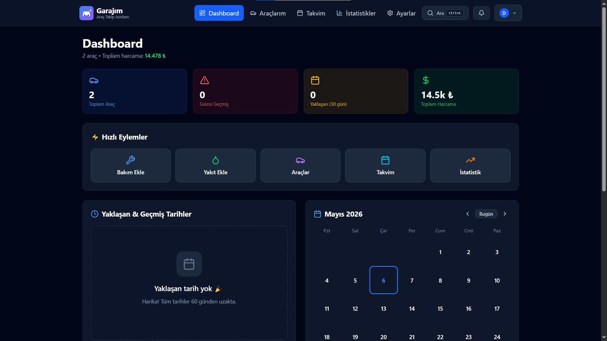
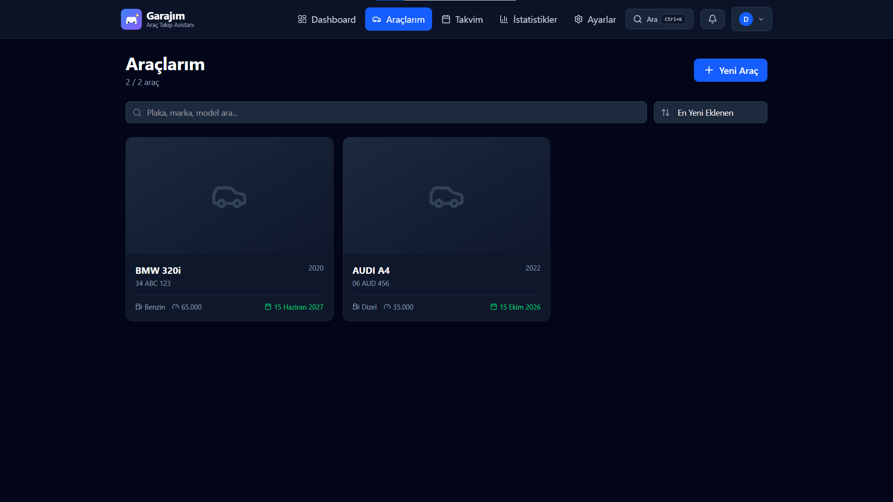
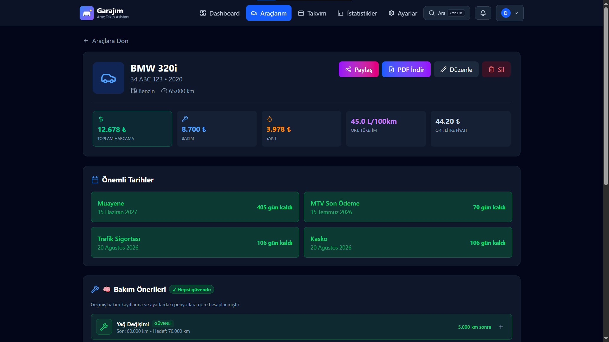
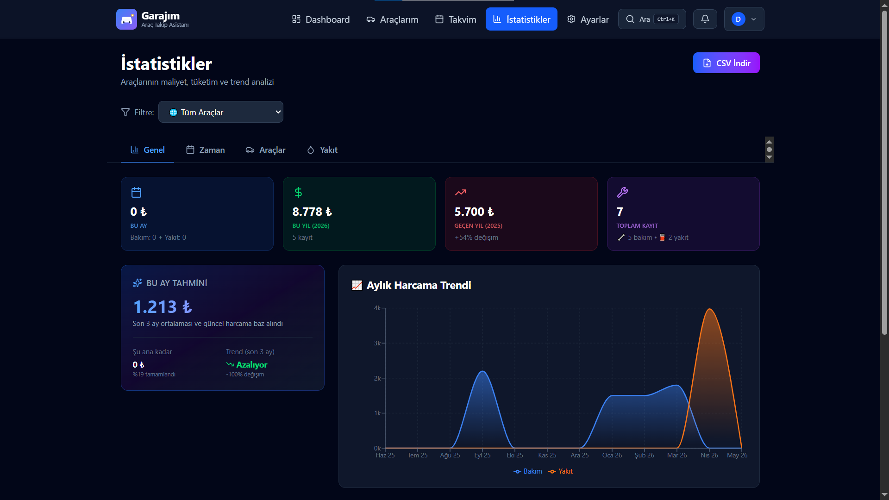
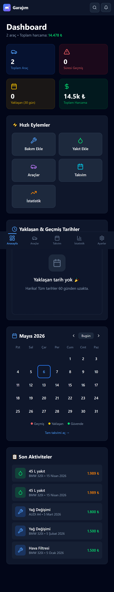
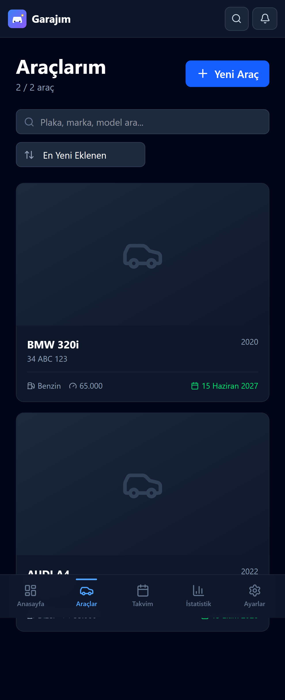
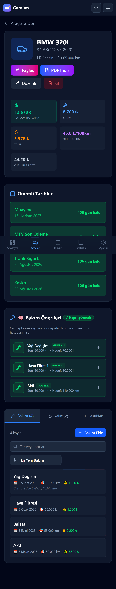
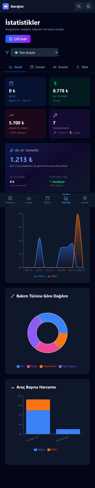

<div align="center">

# 🚗 Garajım

### Araç Bakım & MTV Takip Asistanı

**Aracını takip etmenin en kolay yolu — Bakım, MTV, sigorta, lastik ve yakıt takibi tek uygulamada.**

[](https://garajim-sage.vercel.app)
[](https://github.com/YusufKosarDev/garajim)

[](https://react.dev)
[](https://vitejs.dev)
[](https://supabase.com)
[](https://tailwindcss.com)
[](https://web.dev/progressive-web-apps/)
[](https://cypress.io)
[](LICENSE)

[](https://github.com/YusufKosarDev/garajim/actions/workflows/ci.yml)
[](tsconfig.json)
[](#-testing)
[](src/i18n)

</div>

---

## 📸 Önizleme

<div align="center">

### 💻 Desktop



<details>
<summary>📂 Daha fazla ekran görüntüsü</summary>

<br />

**Araçlarım Sayfası**


**Bakım Takibi**


**İstatistikler**


</details>

### 📱 Mobil

Mobile-first tasarlandı; PWA olarak ana ekrana eklenip native gibi çalışıyor.

<p>
  
  
  
  
</p>

---

## 🌟 Hakkında

**Garajım**, Türkiye'deki araç sahiplerinin tüm araç işlerini takip edebileceği modern bir Progressive Web App (PWA). Bakım kayıtları, MTV ödemeleri, sigorta yenilemeleri, lastik durumu ve yakıt tüketimi — hepsi tek bir uygulamada.

🎯 **Kimin İçin?** Aracını profesyonelce takip etmek isteyen herkes için. **Aileler, küçük filolar, oto galeriler** için çoklu kullanıcı desteği de var.

🔥 **Ne Yapar?** Yaklaşan bakımları hatırlatır, yıllık masrafını gösterir, yakıt tüketimini hesaplar, lastik diş derinliğini takip eder, **yakındaki servisleri haritada bulur**.

⚡ **Production-grade fullstack:** Supabase tabanlı (PostgreSQL + RLS + Storage + Edge Functions), real-time multi-device & multi-user senkron, otomatik email hatırlatmaları (cron + Resend), Google OAuth, PWA, **multi-tenancy workspace pattern**.

🧰 **Mühendislik tarafı:** TypeScript (`strict`, CI'da bloklayan `tsc --noEmit`), **470 unit + 52 E2E test**, iki dil (tr/en — sözlük paritesi testle korunuyor), react-hook-form + Zod form doğrulama, TanStack Query okuma katmanı, çevrimdışı mutasyon kuyruğu, güvenlik başlıklarının tek kaynaktan yönetimi.

---

## ✨ Özellikler

### 🔐 Authentication & Hesap
- ✅ **Email + Şifre** — Email doğrulama zorunlu (production-ready)
- ✅ **Google OAuth** — Tek tıkla giriş ("Sign in with Google")
- ✅ **Şifre sıfırlama** — Email ile güvenli reset
- ✅ **Profil yönetimi** — Şifre/email değiştir (re-authentication ile)
- ✅ **Hesap silme (KVKK)** — Tüm verilerle birlikte kalıcı silme

### 🏢 🆕 Çoklu Kullanıcı / Workspace
- ✅ **Garaj paylaşımı** — Aile üyeleri, partneri, kardeşinle aynı garajı yönet
- ✅ **Email ile davet** — Token-based güvenli davet sistemi
- ✅ **Üye yönetimi** — Owner üye ekleyebilir/çıkarabilir
- ✅ **Roller** — Owner ve Member rolleri
- ✅ **Multi-tenancy mimari** — `garages` + `garage_members` + `garage_invitations` tabloları
- ✅ **Granular RLS** — Workspace pattern ile veri izolasyonu (`user_garage_ids()` helper)

### 🚙 Araç Yönetimi
- ✅ **Çoklu araç desteği** — Sahip olduğun tüm araçları tek yerde
- ✅ **Detaylı bilgi** — Plaka, marka, model, yıl, yakıt tipi, KM
- ✅ **Çoklu fotoğraf** — Cloud storage'a otomatik yükleme (CDN)
- ✅ **Otomatik plaka formatı** — TR plaka formatı doğrulaması

### 📅 Tarih Takibi
- ✅ **Muayene** — Yaklaşan muayene tarihlerini hatırla
- ✅ **MTV** — Motorlu Taşıt Vergisi takibi (Ocak/Temmuz)
- ✅ **Sigorta + Kasko** — Yenileme tarihleri
- ✅ **Akıllı bildirimler** — 30 gün, 7 gün ve 1 gün kala uyarı

### 📧 Email Bildirimleri (Otomatik)
- ✅ **Cron job** — Her gün 09:00'da otomatik kontrol (pg_cron)
- ✅ **Yaklaşan tarih hatırlatması** — Muayene, MTV, sigorta, kasko
- ✅ **Branded HTML email** — Aciliyet renkleri (1 gün → kırmızı, 7 gün → turuncu, 30 gün → mavi)
- ✅ **Kullanıcı tercihleri** — Master switch + 4 spesifik toggle (DB'de saklı)
- ✅ **Resend entegrasyonu** — Modern email API

### 🔄 Real-time Multi-cihaz & Multi-kullanıcı Senkron
- ✅ **WebSocket subscription** — postgres_changes ile canlı dinleyici
- ✅ **Anlık güncelleme** — Telefondan ekleyince bilgisayarda F5'siz görünür
- ✅ **Çoklu kullanıcı sync** — Garajı paylaştığın kişinin değişiklikleri anında ekrana yansır
- ✅ **Echo prevention** — Optimistic UI + duplicate engellemesi
- ✅ **Tüm tablolar** — Araç, bakım, yakıt, lastik, lastik değişim, custom periyot

### 🔧 Bakım Modülü
- ✅ **15+ bakım türü** — Yağ, filtre, balata, vs.
- ✅ **Özel periyot ayarı** — Her araç için ayrı periyot
- ✅ **KM ve tarih bazlı uyarı** — Hangisi önce gelirse
- ✅ **Maliyet takibi** — Toplam harcama analizi
- ✅ **Fatura fotoğrafı** — Cloud storage'a otomatik yükleme

### ⛽ Yakıt Takibi
- ✅ **Detaylı kayıt** — Litre, fiyat, toplam, istasyon
- ✅ **Otomatik hesaplama** — Fiyat × litre = toplam
- ✅ **Tüketim analizi** — L/100km hesabı (full-tank metoduyla)
- ✅ **🆕 Akıllı İçgörü** — "Hep en ucuz istasyondan alsaydın X TL tasarruf ederdin"
- ✅ **İstasyon karşılaştırması** — En ucuz/pahalı vurgu, ortalama TL/L

### 🛞 Lastik Modülü
- ✅ **Yazlık + Kışlık set** — Mevsimlik takip
- ✅ **DOT kod analizi** — Lastik yaşı tespiti
- ✅ **Diş derinliği** — Risk seviyesi (4 kademe)
- ✅ **Mevsim değişim geçmişi** — Tüm değişimler kayıtlı
- ✅ **Türkiye kış lastiği takvimi** — Yasal zorunluluk hatırlatması

### 📊 İstatistikler & Raporlar
- ✅ **Yıllık masraf grafikleri** — Aylık trend analizi
- ✅ **🆕 Yıl sonu maliyet tahmini** — Linear extrapolation ile öngörü
- ✅ **🆕 Year-over-year karşılaştırma** — Geçen yılla bu yılı kıyasla (% fark + trend)
- ✅ **Bakım kategorileri** — Hangi alana ne kadar harcadın
- ✅ **Tahmin algoritmaları** — Sonraki bakım öngörüsü
- ✅ **PDF rapor üretimi** — Türkçe karakter destekli (jsPDF + Roboto)
- ✅ **Paylaşılabilir rapor** — QR kod ile link paylaş

### 🗺️ 🆕 Yakındaki Servisler
- ✅ **OpenStreetMap + Leaflet** — Tamamen ücretsiz harita altyapısı
- ✅ **3 kategori** — Yakıt istasyonu, oto servis, lastikçi
- ✅ **Konum bazlı arama** — Browser Geolocation API ile
- ✅ **Mesafeye göre sıralama** — Haversine distance formülü
- ✅ **Yarıçap kontrolü** — 2/5/10/20 km
- ✅ **Yol Tarifi Al** — Google Maps'e tek tıkla yönlendirme
- ✅ **Production resilience** — 3 Overpass mirror ile fallback (CORS-resistant)
- ✅ **Privacy-first** — Konum sadece tarayıcıda kalır, sunucuya gönderilmez

### 🔔 In-app Bildirimler
- ✅ **Bildirim merkezi** — Slack/Linear tarzı
- ✅ **Browser notifications** — Native API
- ✅ **Akıllı deduplication** — Tekrar eden uyarılar tek seferde

### 🎨 Modern UX
- ✅ **Koyu tema** — Modern ve göze yormaz
- ✅ **Responsive tasarım** — Mobile-first
- ✅ **Swipe-to-action** — iOS Mail benzeri kart kaydırma
- ✅ **Klavye kısayolları** — Ctrl+K komut paleti
- ✅ **Global fuzzy arama** — Türkçe karakter normalize
- ✅ **Bottom navigation** — Mobile için optimize

### 🔐 Güvenlik
- ✅ **Row Level Security** — Workspace pattern ile veri izolasyonu (`user_garage_ids()` helper, `docs/database/policies.sql`)
- ✅ **Storage RLS** — Kullanıcı bazlı klasör izolasyonu (`{userId}/{dosya}`)
- ✅ **Güvenlik başlıkları tek kaynaktan** — CSP, `X-Frame-Options`, `Referrer-Policy`, `Permissions-Policy`. `vercel.json`'da tanımlı ve `vite.config.js` onu okuyup **`npm run preview`'a da uyguluyor** — böylece CSP ihlalleri deploy sonrası değil geliştirme sırasında yakalanıyor
- ✅ **JWT token auth** — Supabase managed
- ✅ **Re-authentication** — Hassas işlemlerde mevcut şifre doğrulama
- ✅ **Paylaşım linki doğrulaması** — `/share/:data` kimlik doğrulaması olmayan tek rota; yükü Zod şemasıyla doğrulanıyor
- ✅ **Vault** — Service role key güvenli saklama
- ✅ **Kaynak haritaları** — `hidden` üretiliyor ve deploy adımında `dist`'ten siliniyor (public sunulmuyor)
- ✅ **HTTPS** — Otomatik SSL (Vercel)

### 📱 PWA
- ✅ **Yüklenebilir** — Ana ekrana ekle, native gibi çalış
- ✅ **Özel service worker** — `injectManifest` modu; `generateSW`'de push ve `notificationclick` handler'ı yazacak yer yoktu (bkz. `src/sw.js`)
- ✅ **Offline cache** — İnternet olmadan da temel özellikler
- ✅ **Çevrimdışı mutasyon kuyruğu** — Bağlantı yokken yapılan değişiklikler kuyruğa alınıp bağlantı gelince gönderiliyor (`src/lib/offlineQueue.ts`)
- ✅ **Otomatik güncelleme** — Workbox ile

### 🌍 Çoklu Dil (tr / en)
- ✅ **Tam çeviri** — İki sözlükte de 1261 anahtar; **anahtar kümelerinin birebir aynı olması testle zorunlu** (`src/i18n/i18n.test.ts`)
- ✅ **Veritabanı değerleri çevrilmez** — "Yağ Değişimi" ekranda etiket gibi görünür ama `maintenance_records.type` sütununda duran bir VERİ. Çevrilirse bakım öneri motoru eşleşmeyi kaybeder; bu kural ayrı bir testle çitlenmiş
- ✅ **Talep üzerine yükleme** — Sözlükler dinamik chunk; yalnızca aktif dil iniyor
- ✅ **`<html lang>` senkronu** — Ekran okuyucu ve tarayıcı çevirisi doğru dili görüyor
- ✅ **Ham anahtar taraması** — 6 rota × 2 dil E2E kontrolü: ekranda hiç `foo.bar` biçimi görünmemeli
- ✅ **Envanter aracı** — `npm run i18n:audit` t() dışında kalmış Türkçe metinleri listeler

### 🧰 Kod Kalitesi
- ✅ **TypeScript** — `strict`; utils, lib, hooks, context ve ortak bileşenler TS'te (58 dosya). CI'da `tsc --noEmit` **bloklayıcı**
- ✅ **Lint** — 0 hata politikası; `react-hooks` kuralları açık
- ✅ **Form doğrulama** — react-hook-form + Zod; mevcut doğrulayıcılar yeniden yazılmadı, `superRefine` içinden çağrılıyor (tek doğruluk kaynağı)
- ✅ **Okuma katmanı** — TanStack Query: retry + backoff, sekmeye dönünce tazeleme, istek birleştirme
- ✅ **Hata izleme** — Sentry, varsayılan **kapalı**; `VITE_SENTRY_DSN` yoksa hiç yüklenmiyor
- ✅ **Dependabot** — Minor/patch gruplu, major ayrı

### 🆕 🧪 Test Coverage
- ✅ **Unit tests** — Vitest ile **470 test / 32 dosya** (saf mantık, context, bileşenler, i18n sözleşmeleri)
- ✅ **Component tests** — React Testing Library ile form render + validasyon
- ✅ **E2E tests** — Cypress ile **52 test / 10 suite** (login, araçlar, istatistik, takvim, dil, 404, paylaşılan rapor)
- ✅ **Sabit zaman** — `vi.setSystemTime()` ile takvime bağlı testler deterministik
- ✅ **Session caching** — `cy.session({ cacheAcrossSpecs })` ile spec'ler arası tek login
- ✅ **Custom commands** — `cy.login()`, `cy.logout()`, `cy.checkToast()`
- ✅ **CI** — GitHub Actions: lint → unit test → build, ardından E2E

---

## 🛠️ Tech Stack

### Frontend
- **React 19** — UI library
- **TypeScript 6** — `strict`; utils/lib/hooks/context tamamen TS
- **Vite 8** — Build tool (HMR, hızlı build)
- **React Router v7** — Client-side routing
- **Tailwind CSS v4** — Utility-first styling
- **TanStack Query v5** — Sunucu durumu: cache, retry + backoff, yeniden doğrulama
- **react-hook-form + Zod** — Form durumu ve şema doğrulama
- **i18next + react-i18next** — tr/en çoklu dil (talep üzerine yüklenen sözlükler)
- **Lucide React** — Modern ikonlar
- **Framer Motion** — Animasyonlar
- **Recharts** — Grafik ve istatistikler
- **Leaflet + react-leaflet** — Harita render (OpenStreetMap tile)
- **Tesseract.js** — Fişten OCR ile tutar/tarih/km okuma
- **react-hot-toast** — Toast bildirimleri
- **date-fns** — Tarih işlemleri
- **jsPDF + autoTable** — PDF rapor üretimi (Türkçe/İngilizce, Roboto gömülü)
- **lz-string** — URL'de paylaşım için sıkıştırma
- **qrcode.react** — QR kod üretimi
- **Vite PWA Plugin** — Özel service worker (`injectManifest`), manifest
- **@sentry/react** — Hata izleme (opsiyonel, varsayılan kapalı)
- **@supabase/supabase-js** — Supabase client + real-time

### Backend (Supabase)
- **PostgreSQL** — Database (şema: `docs/database/schema.sql`)
- **Row Level Security** — workspace pattern (`docs/database/policies.sql`)
- **Supabase Auth** — Email/Password + Google OAuth + email confirmation
- **Supabase Storage** — Fotoğraf yönetimi (2 bucket, kullanıcı bazlı klasör izolasyonu, CDN)
- **Real-time** — postgres_changes WebSocket (multi-cihaz + multi-user sync)
- **Edge Functions** — 4 Deno serverless function (kaynaklar: `supabase/functions/`):
  - `send-reminder-emails` — Cron tetiklemeli email reminder
  - `delete-account` — KVKK uyumlu hesap silme + Storage cleanup
  - `invite-member` — Garaja üye davet sistemi
  - `accept-invitation` — Davet kabul + üye ekleme
- **pg_cron** — Scheduled tasks (her gün 09:00 email reminder)
- **Vault** — Service role key güvenli secret saklama

### Email & Bildirim
- **Resend** — Modern email API (3000 email/ay free tier)
- **Branded HTML templates** — Türkçe + responsive

### Harita & Konum
- **OpenStreetMap** — Açık kaynak harita verisi
- **Overpass API** — POI (Point of Interest) sorgulama
- **Leaflet** — Interactive map library
- **Browser Geolocation API** — Konum izni

### Testing
- **Vitest 5** — Unit + bileşen testleri (jsdom), v8 coverage
- **React Testing Library** — Bileşen render ve etkileşim
- **Cypress 15** — End-to-End testing framework
- **Custom commands** — `cy.login()`, `cy.visitInLanguage()`, `cy.assertNoRawI18nKeys()`
- **Session caching** — `cy.session({ cacheAcrossSpecs })` ile spec'ler arası tek login

### DevOps
- **GitHub Actions** — lint → typecheck → unit test → build, ardından E2E
- **Dependabot** — Haftalık npm, aylık actions; minor/patch gruplu
- **Vercel** — Hosting + CI/CD (otomatik deploy on push)
- **`.npmrc`** — `legacy-peer-deps` ile peer dependency uyumluluğu
- **`.gitattributes`** — Satır sonları depoda LF

---

## 🏗️ Mimari

### Yüksek Seviye Mimari

```
┌─────────────────────────────────────────────────────────────┐
│                       Garajım PWA                            │
│              (React 19 + Vite 8 + Tailwind v4)               │
└─────────────────┬───────────────────────────────────────────┘
                  │
                  │ HTTPS / WebSocket
                  ▼
┌─────────────────────────────────────────────────────────────┐
│                      Supabase Cloud                          │
├──────────────┬──────────────┬──────────────┬───────────────┤
│   Auth       │  PostgreSQL  │   Storage    │ Edge Functions│
│ (Email +     │ (11 tables + │  (2 buckets, │   (Deno,      │
│  Google      │  RLS + cron) │   CDN)       │   5 functions)│
│  OAuth)      │              │              │               │
└──────────────┴──────────────┴──────────────┴───────────────┘
                                                  │
                                                  ▼
                                    ┌─────────────────────┐
                                    │  External Services   │
                                    ├─────────────────────┤
                                    │  • Resend (email)    │
                                    │  • Overpass API      │
                                    │    (OpenStreetMap)   │
                                    └─────────────────────┘
```

### Database Schema (11 Tablo)

**Core tabloları:**
- `profiles` — Kullanıcı profil ek bilgileri
- `vehicles` — Araç kayıtları
- `maintenance_records` — Bakım kayıtları
- `fuel_records` — Yakıt kayıtları
- `tire_sets` — Lastik setleri
- `tire_changes` — Mevsim değişim geçmişi
- `custom_intervals` — Araç bazlı özel periyotlar
- `notification_preferences` — Email bildirim tercihleri

**Workspace tabloları:**
- `garages` — Workspace (her kullanıcının kendi garajı)
- `garage_members` — Üyelik tablosu (owner/member roller)
- `garage_invitations` — Davet sistemi (token-based)

### RLS Pattern: Workspace Isolation

Custom helper function ile workspace pattern:

```sql
CREATE FUNCTION public.user_garage_ids()
RETURNS SETOF UUID
LANGUAGE sql STABLE SECURITY DEFINER AS $$
  SELECT garage_id FROM garage_members WHERE user_id = auth.uid()
$$;
```

Tüm tablo politikaları bu helper'ı kullanır:

```sql
CREATE POLICY "Users see their garage data"
ON vehicles FOR SELECT
USING (garage_id IN (SELECT user_garage_ids()));
```

---

## 🚀 Kurulum

### Gereksinimler
- Node.js 22+ (CI Node 22 kullanıyor)
- npm 10+
- Supabase hesabı (free tier yeterli)
- Resend hesabı (opsiyonel — email bildirimleri için)

### 1. Repo'yu Klonla

```bash
git clone https://github.com/YusufKosarDev/garajim.git
cd garajim
```

### 2. Bağımlılıkları Yükle

```bash
npm install
```

> 💡 React peer dependency uyarıları için `.npmrc` dosyası `legacy-peer-deps=true` ile yapılandırılmıştır.

### 3. Environment Variables

`.env` dosyası oluştur (`.env.example` örnek olarak verilmiştir):

```env
VITE_SUPABASE_URL=https://your-project.supabase.co
VITE_SUPABASE_ANON_KEY=your-anon-key
```

### 4. Supabase Kurulumu

Supabase projesi oluştur ve aşağıdaki adımları uygula:

> ⚠️ **`docs/database/` altındaki SQL, client kodundan TÜRETİLMİŞTİR** — production
> dump'ı değil. Tablo ve sütun adları güvenilir; RLS policy gövdeleri, `garage_id`
> trigger'ı ve indeksler yeniden kurgulanmıştır ve `-- KURGU` ile işaretlidir.
> Neyin kanıtlı neyin tahmin olduğu **[`docs/database/README.md`](docs/database/README.md)**
> içinde madde madde yazıyor. Olduğu gibi çalıştırmak çalışan bir kopya vermez.

1. **Database schema** — [`docs/database/schema.sql`](docs/database/schema.sql) çalıştır
2. **RLS policies** — [`docs/database/policies.sql`](docs/database/policies.sql) çalıştır
3. **Storage buckets** — `vehicle-photos` ve `maintenance-photos` (public). Dosya
   yolu deseni `{userId}/{dosyaAdı}` — storage policy'leri buna dayanıyor
4. **Edge Functions deploy** — [`supabase/functions/`](supabase/functions) altındaki 4 fonksiyon:
   - `invite-member` — garaja üye daveti (Resend ile e-posta)
   - `accept-invitation` — davet kabulü (idempotent)
   - `delete-account` — KVKK uyumlu silme + Storage temizliği
   - `send-reminder-emails` — pg_cron tetiklemeli hatırlatma e-postaları
   ```bash
   supabase functions deploy invite-member accept-invitation delete-account send-reminder-emails
   ```
5. **Email Confirmation** — Auth → Settings'de aktif et
6. **Google OAuth** (opsiyonel) — Auth → Providers → Google
7. **Secrets** — Supabase Secrets'a `RESEND_API_KEY`, `SITE_URL` ve
   (opsiyonel) `RESEND_FROM` ekle
8. **pg_cron schedule** — Her gün 09:00'da `send-reminder-emails` tetikle
   (taslak: `docs/database/policies.sql`'in sonu)

### 5. Geliştirme Sunucusu

```bash
npm run dev
```

Tarayıcıda `http://localhost:5173` aç.

### 6. Production Build

```bash
npm run build
npm run preview
```

---

## 📦 Production Deploy

Vercel ile otomatik deploy:

1. GitHub repo'sunu Vercel'e bağla
2. Environment variables ekle (yukarıdaki `.env` değişkenleri)
3. `main` branch'e push → otomatik deploy

> 💡 `.npmrc` dosyası sayesinde Vercel build sırasında peer dependency hatası vermez.

---

## 🧪 Testing

İki katman: saf mantık için **Vitest** unit testleri, kritik kullanıcı akışları için **Cypress** E2E.

### Test Coverage

**Unit (Vitest) — 32 dosya, 470 test:**

| Modül | İçerik |
|-------|--------|
| `dateHelpers` | Tarih formatlama, `daysUntil`, yerel tarih anahtarı (timezone regresyonu) |
| `dateValidation` | Geçmiş/gelecek tarih ve araç yılı doğrulama |
| `plateHelpers` | TR plaka biçimlendirme ve doğrulama |
| `kmHelpers` | Km tutarlılık kontrolleri |
| `fuelHelpers` | L/100km tüketim, ortalama fiyat |
| `tireHelpers` | DOT yaş hesabı, diş derinliği, mevsim önerisi |
| `maintenanceRecommendations` | Periyot anahtar sözleşmesi, öneri motoru |
| `statisticsHelpers` | Aylık/yıllık harcama, araç ve istasyon analizi |
| `fuzzySearch` | Türkçe karakter normalizasyonu, fuzzy eşleşme |
| `supabaseMappers` | DB ↔ frontend dönüşümleri |
| `vehicleValuation` | Araç değer tahmini: yaş/km/bakım etkisi, güven seviyesi |
| `fuelPriceAnalysis` | Zaman farkındalıklı fiyat analizi, tasarruf içgörüsü |
| `receiptParser` | Fişten tutar/tarih/km ayrıştırma |
| `icsExport` | Takvim dışa aktarımı, kaçış karakterleri, satır katlama |
| `offlineQueue` | Çevrimdışı mutasyon kuyruğu |
| `shareHelpers` | Paylaşım yükü gidiş-dönüşü **ve güvensiz girdinin reddi** |
| `pdfGenerator` | Dinamik import + rapor başlıklarının aktif dilde üretilmesi |
| `utilMessages` | Util'lerin döndürdüğü metinlerin **İngilizce modda gerçekten İngilizce** olması |
| `i18n` | 11 sözleşme: tr/en paritesi, DB değerlerinin çeviriye girmemesi, dil davranışı |
| `VehicleContext` | Mutasyon güvenlik ağı (24 test) |
| `useKeyboardShortcuts` | Tek tuş, iki tuşlu diziler, input/modal bastırması, `enabled` |
| `ProtectedRoute` | Yükleme sırasında sızıntı yok, yönlendirme, `state.from` |
| `Dashboard` | Karşılama ekranı, 60 gün eşiği, sıralama, toplam harcama |
| Form bileşenleri | `FuelForm`, `MaintenanceForm`, `VehicleForm`, `TireForm`, `TireChangeForm` |
| `TireDisplay` | Pozisyon/sezon etiketlerinin ham anahtar basmaması |

> Zamana bağlı fonksiyonlar `vi.setSystemTime()` ile sabit tarihte koşar; aksi halde testler takvime göre kırılırdı.
>
> Testler dili açıkça `tr`'ye sabitler (`src/test/setup.js`). Bunun bir sonucu var: Türkçe koşan bir test, "İngilizce çeviri eksik" hatasını yapısal olarak göremez. O yüzden `utilMessages.test.ts` dili açıkça `en`'e alıp ayrıca kontrol eder.

**E2E (Cypress) — 10 suite, 52 test:**

| Suite | Test | İçerik |
|-------|------|--------|
| `login.cy.js` | 4 | Login UI, geçerli credentials, yanlış şifre, auth redirect |
| `vehicles.cy.js` | 3 | Sayfa render, araç listesi, detay sayfasına geçiş |
| `statistics.cy.js` | 3 | Sayfa render, tab navigation, CSV İndir modali |
| `calendar.cy.js` | 4 | Takvim görünümü, olay listesi |
| `command-palette.cy.js` | 5 | Ctrl+K, arama, gezinme |
| `language.cy.js` | 5 | Dil değiştirme, kalıcılık, ham anahtar sızmaması |
| `i18n-raw-keys.cy.js` | 18 | **6 rota × 2 dil** + araç detayı + CSV modali ham anahtar taraması |
| `not-found.cy.js` | 4 | 404 içeriği, iki dil, catch-all'ın gerçek rotaları gölgelememesi |
| `shared-report.cy.js` | 4 | Herkese açık rota: geçerli yük, bozuk yük, yanlış tip, versiyon |
| `nearby.cy.js` | 2 | Lazy route çözümü, konum izni ekranı |

### Komutlar

```bash
# Hepsi bir arada (CI ile aynı kapı)
npm run verify          # lint + typecheck + unit test + build

# Unit testler
npm test
npm run test:watch
npm run test:coverage

# Tip kontrolü ve lint
npm run typecheck
npm run lint

# i18n envanteri (t() dışında kalmış Türkçe metinler)
npm run i18n:audit
npm run i18n:audit -- --say   # yalnızca sayı

# E2E — interactive mode (Cypress GUI)
npm run cypress:open

# E2E — dev sunucusuna karşı (5173)
npm run test:e2e

# E2E — ÜRETİM bundle una karşı (4173) — build + preview gerekir
npm run test:e2e:preview
```

> 💡 E2E testleri çalıştırmadan önce `npm run dev` ile dev server'ı başlat — Cypress `localhost:5173`'e bağlanır. Unit testler dev server gerektirmez.

### Hata İzleme (opsiyonel)

Sentry entegrasyonu hazır ama **varsayılan olarak kapalı**. `.env` dosyasına
`VITE_SENTRY_DSN` eklemezsen Sentry hiç yüklenmez — dinamik import olduğu için
Rollup onu tamamen eleme yapar, ne ağ isteği ne bundle maliyeti kalır.

Açıldığında `ErrorBoundary`, veri yükleme hataları ve global yakalanmamış
hatalar (`unhandledrejection`, `window.error`) raporlanır. Context anahtarları
(`where`, `kind`) **çevrilmez** — telemetri kullanıcının arayüz diline göre
değişmemeli.

> Kaynak haritaları `hidden` üretiliyor; okunabilir stack trace için Sentry'ye
> ayrıca yüklenmeleri gerekir.

### Paket Boyutu

Sözlükler statik import edildiğinde ikisi birden ana chunk'ta ~167 kB (45 kB
gzip) yer kaplıyordu, oysa kullanıcı her zaman yalnızca birini okuyor. Dinamik
import'a alındı ve satıcı kodu kütüphane bazında gruplandı:

| İlk yük (index.html'in istediği her şey) | Dosya | Raw | **gzip** |
|---|---|---|---|
| Öncesi | 9 | 1.222.766 B | **345.749 B** |
| Sonrası | 22 | 1.081.889 B | **311.036 B** |

Ana chunk 911 kB → 122 kB raw (264 → 31 kB gzip). Ağır kütüphaneler rota
chunk'larında kalıyor: `pdfGenerator` (136 kB gzip) yalnızca PDF indirilirken,
`recharts` istatistiklerde, `leaflet` haritada, `tesseract` fiş okumada iniyor.

> Denenip **geri alınan** bir yaklaşım: tüm `node_modules`'ü tek `vendor`
> chunk'ında toplamak. jspdf/recharts/leaflet/tesseract'ı eager hâle getirdiği
> için ilk yükü 739 kB gzip'e çıkardı.

### CI

`.github/workflows/ci.yml` her push ve PR'da çalışır:

- **quality** — lint → **typecheck** → unit test → build. Dış bağımlılık yok, her zaman koşar. `tsc --noEmit` bloklayıcıdır.
- **e2e** — Cypress. Gerçek bir Supabase projesi gerektirdiği için `VITE_SUPABASE_URL` ve `VITE_SUPABASE_ANON_KEY` secret'ları tanımlı değilse (örn. fork PR'ları) sessizce atlanır.
- **i18n envanteri** — `npm run i18n:audit` raporu. **Bloklamaz**: sezgisel bir tarama olduğu ve yanlış pozitif üretebildiği için CI'ı kırmaması kasıtlı.

Yerelde hepsini tek komutta koşmak için: `npm run verify`

> 💡 E2E'yi yerelde koşarken önce bir sunucu gerekiyor: `npm run dev` (5173) ya
> da üretim bundle'ına karşı `npm run build && npm run preview` +
> `npm run test:e2e:preview` (4173).

### Custom Commands

Kendi `cy.login()` ve helper'larımız var (`cypress/support/commands.js`):

```js
beforeEach(() => {
  cy.login()  // Demo hesapla otomatik login (session caching ile hızlı)
})

it('test örneği', () => {
  cy.visit('/vehicles')
  cy.checkToast('Hoş geldin')  // Toast mesajı kontrol
})
```

### Test Stratejisi

- **Session caching** — `cy.session()` ile login state cache'lenir (her test'te tekrar login yapmaz)
- **Defensive testing** — Spesifik veri yerine yapısal kontroller (örn: "BMW yerine `a[href*='/vehicles/']`")
- **Retry mekanizması** — Flaky test'lere karşı CI mode'da 1 retry otomatik
- **Force click** — Modal overlay sorunlarına karşı `{ force: true }` kullanımı

### Dosya Yapısı

```
cypress/
├─ e2e/                      # Test dosyaları
│  ├─ login.cy.js
│  ├─ vehicles.cy.js
│  └─ statistics.cy.js
├─ support/
│  ├─ commands.js            # Custom cy.login(), cy.logout(), vs.
│  └─ e2e.js                 # Global config
└─ fixtures/                 # Test data
```

---

## 🧪 Demo Hesabı

Live demo'yu test etmek için:

```
URL:     https://garajim-sage.vercel.app
Email:   demo@garajim.com
Şifre:   Demo1234!
```

Demo hesabında 2 araç (BMW + Audi), bakım kayıtları, yakıt kayıtları ve örnek veriler hazırdır.

---

## 🗺️ Roadmap

### ✅ Tamamlandı
- [x] Frontend MVP (LocalStorage tabanlı)
- [x] Supabase fullstack dönüşüm (Auth + DB + Storage)
- [x] PWA (offline cache, install prompt)
- [x] Email confirmation + Google OAuth
- [x] Real-time multi-device sync
- [x] Email reminder (cron + Resend)
- [x] Hesap silme (KVKK)
- [x] Çoklu kullanıcı / Workspace
- [x] Predictive analytics (yıl sonu tahmini)
- [x] Yakındaki servisler (OpenStreetMap)
- [x] Cypress E2E test coverage
- [x] Vitest unit test katmanı (470 test)
- [x] GitHub Actions CI (lint → typecheck → test → build → E2E)
- [x] TypeScript geçişi (utils, lib, hooks, context, ortak bileşenler)
- [x] Çoklu dil (tr/en) — sözlük paritesi testle korunuyor
- [x] react-hook-form + Zod form doğrulama
- [x] TanStack Query okuma katmanı
- [x] Çevrimdışı mutasyon kuyruğu
- [x] Fişten OCR (Tesseract.js)
- [x] Araç değer tahmini
- [x] .ics takvim dışa aktarımı
- [x] Güvenlik başlıkları (CSP dahil) tek kaynaktan
- [x] Sentry hata izleme (opsiyonel, varsayılan kapalı)

### 🔮 Gelecek Özellikler
- [ ] Bildirimler için PWA push notifications
- [ ] OBD-II entegrasyonu (Bluetooth)
- [ ] Servis randevu sistemi
- [ ] Sürücü davranış skorlaması
- [ ] Yakıt fiyatı uyarıları (geo-bazlı)

---

## 🤝 Katkıda Bulunma

Pull request'ler memnuniyetle karşılanır. Büyük değişiklikler için önce issue açın.

```bash
git checkout -b feature/yeni-ozellik
git commit -m "Feat: Yeni özellik açıklaması"
git push origin feature/yeni-ozellik
```

---

## 📄 Lisans

[MIT](LICENSE) © Yusuf Koşar

---

## 👨‍💻 Geliştirici

**Yusuf Koşar** — Frontend → Fullstack Developer

- 🌐 GitHub: [@YusufKosarDev](https://github.com/YusufKosarDev)
- 🔗 Proje: [garajim-sage.vercel.app](https://garajim-sage.vercel.app)

---

<div align="center">

**Aracını takip etmenin en kolay yolu** 🚗💨

⭐ Beğendiyseniz **star** atmayı unutmayın!

</div>
